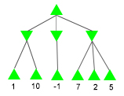
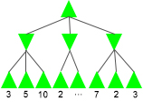
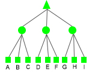
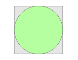

# Adversarial Search Algorithm in Game Theory #

## Mimimax Algorithm ##

#### _Constraints_: ####
1. 2-player zero-sum (one player wins and the other loses) adversarial game
2. Players take turns to make move
3. Assume opponent plays optimal way
4. Need a score(value) associated with each state (usually from evaluation function)
5. Need a winning and losing state

#### _Description_: ####
- Each possible move will generate a successor state, and player will choose the move that will lead to the state with highest score.
- There will be two kinds of layers, MAX layer and MIN layer
- MAX layer gets the maximum value of its children
- MIN layer gets the minimum value of its children
- MAX layer and MIN layer happening iteratively and repeatedly, +1 level for each layer and +1 depth for each pair,until the game tree reaches a terminal state or the maximum depth defined

#### _Example_: ####


#### _Complexity_: ####
   _Assume on average each node has b successors and depth is d_
    
    O(bˣbˣbˣ...ˣb) = O(b^d)


```python
class MinimaxPolicy():
    def __init__(self, index=0, depth=2):
        """Abstract class of Algorithms using Minimax Policy
        By default 3 kinds of optimizer defined
        1. Minimizer, returns the tupe with minimum first value
        2. Maximizer, returns the tupe with maximum first value
        3. Expectation_Adder, returns a tuple containing sum of first values and None
        
        Parameters
        ----------
        index : int
            Current agent index in agent array.
        depth : int
            The depth of game tree going to expand.
        """
        self.index = 0
        self.depth = depth
        self.minimizer = lambda *iterable: min(iterable,
                                               key=lambda val: val[0])
        self.maximizer = lambda *iterable: max(iterable,
                                               key=lambda val: val[0])
        self.expectation_adder = lambda *iterable: (sum([val[0]
                                                         for val
                                                         in iterable]),
                                                    None)

    def evaluationFunction(self, game_state):
        """
        @todo To be implemented according to the rule of game
        """ 
        raise NotImplementedError("To be implemented")
        
    def get_optimize_specifics(self, agent_index):
        """
        Get optimizer and inital best score
        Abstract function to be defined in inheritor separately.
        
        Parameters
        ----------
        agent_index : int
            The agent index in agent array.

        Returns
        -------
        (function, (float, Action))
            tuple of optimizer and inital best score from agent index
        """
        raise NotImplementedError("To be implemented")

    def minimax(self, agent_index, game_state, depth, alpha=None, beta=None):
        """
        Get optimizer and inital best score
        Abstract function to be defined in inheritor separately.
        
        Parameters
        ----------
        agent_index : int
            The agent index in agent array.
        game_state: State
            State of the game
        depth: int
            Current depth
        alpha: int
            Alpha value if using alpha-beta pruning
        beta: int
            Beta value if using alpha-beta purning

        Returns
        -------
        (function, (float, Action))
            tuple of optimizer and inital best score from agent index
        """
        # Check Terminal State or not
        if game_state.isWin() or game_state.isLose():
            return (self.evaluationFunction(game_state), None)

        optimizer, best_score = self.get_optimize_specifics(agent_index)

        # Take one step ahead
        if agent_index + 1 < game_state.getNumAgents():
            next_agent_index = agent_index + 1
            next_depth = depth
        else:
            next_agent_index = 0
            next_depth = depth + 1

        # Traverse through possible successors
        legal_actions = game_state.getLegalActions(agent_index)
        for action in legal_actions:
            successor_state = game_state.generateSuccessor(agent_index,
                                                           action)
            # Get score of current node if reaches the max depth
            # otherwise keep expanding
            if next_depth > self.depth:
                successor_score = (self.evaluationFunction(successor_state),
                                   None)
            else:
                successor_score = (self.minimax(next_agent_index,
                                                successor_state,
                                                next_depth,
                                                alpha,
                                                beta)[0],
                                   action)

            # Update Best score and alpha beta values if applies
            if optimizer == self.maximizer:
                best_score = optimizer(best_score,
                                       successor_score)
                alpha = alpha and optimizer(alpha,
                                            best_score)
            elif optimizer == self.minimizer:
                best_score = optimizer(best_score,
                                       successor_score)
                beta = beta and optimizer(beta,
                                          best_score)
            elif optimizer is self.expectation_adder:
                best_score = optimizer(best_score,
                                       (1./len(legal_actions) *
                                        successor_score[0],
                                        None))
            else:
                 raise NotImplementedError("To be implemented")

            # Pruning if applies
            if alpha and beta and alpha[0] >= beta[0]:
                return best_score

        return best_score
```


```python
class MinimaxAgent(MinimaxPolicy):
    def __init__(self, index, depth):
        """Agent using minimax algorithm
        
        Parameters
        ----------
        index : int
            Current agent index in agent array.
        depth : int
            The depth of game tree going to expand.
        """
        self._player_optimizer = (self.maximizer, (-float('inf'), None))
        self._opponent_optimizer = (self.minimizer, (float('inf'), None))
        
        return super().__init__(index=index, depth=depth)
    
    def evaluationFunction(self, game_state):
        """        
        Parameters
        ----------
        game_state : State
            Game State.
        
        Returns
        -------
        int
            Value associated with the game state
        """ 
        game_state.get_score()
    
    def get_optimize_specifics(self, agent_index):
        """
        Get optimizer and inital best score
        """
        if agent_index == self.index:
            return (self.maximizer, (-float('inf'), None))
        else:
            return (self.minimizer, (float('inf'), None))

    def getAction(self, gameState):
        """
        Returns the action associated with best score
        """
        _, action = self.minimax(self.index,
                                 gameState,
                                 1)
        return action
```

## Alpha-Beta Pruning (Optimation Method of Minimax) ##

#### _Desciption_: ####
    - There will be two variables storing evaluated max and min values, which are ⍺ and β respectively
    - Initial value of ⍺ is -∞, and initial value of β is ∞
    - MAX layer only update ⍺
    - MIN layer only update β
    - Pruning the rest whenever ⍺ >= β

#### _Example_: ####

```
Step 1:
MAX{                  ⍺ = -∞
        β = ∞
        ↓
    MIN{3, 5, 10},
    MIN{2, a, b},
    MIN{7, 2, 3},
}

Step 2:
MAX{                  ⍺ = -∞
           β = 3
           ↓
    MIN{3, 5, 10},
    MIN{2, a, b},
    MIN{7, 2, 3},
}

Step 3:
MAX{                  ⍺ = -∞
              β = 3
              ↓
    MIN{3, 5, 10},
    MIN{2, a, b},
    MIN{7, 2, 3},
}

Step 4:
MAX{                  ⍺ = 3
    MIN{3, 5, 10},
        β = ∞
        ↓
    MIN{2, a, b},
    MIN{7, 2, 3},
}

Step 5:
MAX{                  ⍺ = 3
    MIN{3, 5, 10},
           β = 2(pruning because MIN{2, a, b} <= 2 <= 3, result of outer MAX will never fall on MIN{2, a, b})
           ↓
    MIN{2, a, b},
    MIN{7, 2, 3},
}

Step 6:
MAX{                  ⍺ = 3
    MIN{3, 5, 10},
    MIN{2, a, b},
        β = ∞
        ↓
    MIN{7, 2, 3},
}

Step 7:
MAX{                  ⍺ = 3
    MIN{3, 5, 10},
    MIN{2, a, b},
           β = 7
           ↓
    MIN{7, 2, 3},
}

Step 8:
MAX{                  ⍺ = 3
    MIN{3, 5, 10},
    MIN{2, a, b},
              β = 2(pruning because MIN{7, 2, 3} <= 2 <= 3, result of outer MAX will never fall on MIN{7, 2, 3})
              ↓
    MIN{7, 2, 3},
}
```

#### _Complexity_: ####

   _Assmue each node has b successors and depth is d_<br>
   _Worst Case_: No pruning happening, same complexity as minimax<br>
   _Best Case_: First evaluated node is the best node, so that 1 for MAX layer and b for last MIN layer(it is possible to have multiple MIN layers)
   
             O(1ˣbˣ1ˣbˣ...ˣb) = O(b^(d/2))
             
    Therefore, within the same amount of time Minimax with alpha-beta pruning could traverse 2 times deeper


```python
class AlphaBetaAgent(MinimaxPolicy):
    def __init__(self, index, depth):
        """Agent using Alpha-Beta Pruning algorithm
        
        Parameters
        ----------
        index : int
            Current agent index in agent array.
        depth : int
            The depth of game tree going to expand.
        """
        self._player_optimizer = (self.maximizer, (-float('inf'), None))
        self._opponent_optimizer = (self.minimizer, (float('inf'), None))

        return super().__init__(index=index, depth=depth)
    
    def evaluationFunction(self, game_state):
        """        
        Parameters
        ----------
        game_state : State
            Game State.
        
        Returns
        -------
        int
            Value associated with the game state
        """ 
        game_state.get_score()
    
    def get_optimize_specifics(self, agent_index):
        """
        Get optimizer and inital best score
        """
        if agent_index == self.index:
            return self._player_optimizer
        else:
            return self._opponent_optimizer

    def getAction(self, gameState):
        """
          Returns the action associated with best score
        """
        _, action = self.minimax(self.index,
                                 gameState,
                                 1,
                                 (-float('inf'), None),
                                 (float('inf'), None))
        return action
```

## Expectimax ##

#### _Description_: ####
   - MAX layer remains the same
   - MIN layer is replaced by chance nodes, that's to say each possible opponent move is associated with a weight(possibility) and the result is the sum of (weight ˣ score)
   - Minimax almost could be considered as a special case of expectimax that min value has weight of 1.0 and others are 0
```
    Solves more realistic problem that result will not be too much biased by the minimum value since weights could be changed according to different kinds of opponents, so we don't need to assume opponent makes the optimal move.
```

#### _Example_: ####


```
MAX{
    w1ˣA + w2ˣB + w3ˣC,
    w4ˣD + w5ˣE + w6ˣF,
    w7ˣG + w8ˣH + w9ˣI,
}
```


```python
class ExpectimaxAgent(MinimaxPolicy):
    def __init__(self, index, depth):
        """Agent using Expectimax algorithm
        
        Parameters
        ----------
        index : int
            Current agent index in agent array.
        depth : int
            The depth of game tree going to expand.
        """
        self._player_optimizer = (self.maximizer, (-float('inf'), None))
        self._opponent_optimizer = (self.expectation_adder, (0, None))
        
        return super().__init__(index=index, depth=depth)
    
    def evaluationFunction(self, game_state):
        """        
        Parameters
        ----------
        game_state : State
            Game State.
        
        Returns
        -------
        int
            Value associated with the game state
        """ 
        game_state.get_score()
    
    def get_optimize_specifics(self, agent_index):
        """
        Get optimizer for player or opponent
        """
        if agent_index == self.index:
            return self._player_optimizer
        else:
            return self._opponent_optimizer

    def getAction(self, gameState):
        """
        Returns the action associated with best score
        """
        _, action = self.minimax(self.index,
                                 gameState,
                                 1)
        return action
```

## Optimizations ##

### Zobrist Hash ###

##### _Decription_: #####
   - Compute the hash of a state

##### _Steps_: #####
   1. Initialize a 3 dimensional table that contains keys for each possible case on board
   2. Start with 0 and do XOR operation for each non empty position on board

##### _Advantages_: #####
   1. When player makes a move, no need to recalculate everything because (A XOR B XOR B = A)
   2. Less hash table collision (Complex mathmatical prove behind this, Skip)
   
##### _Disadvantages_: #####
   1. Common drawback of tabulation hash that requires certain amount of memory to store keys 

##### _Example_: #####

_Tic-Tac-Toe_:


```python
from random import randint

# dictionary storing the piece keys to zobrist table
pieces = {
    'x': 0,
    'o': 1,
}
board_height = 3
board_width = 4
# Zobrist table value for each piece in board
zobrist_table = [[[randint(1, 2**63) for _ in pieces] for _ in range(board_width)] for _ in range(board_height)]

def get_hash(board):
    height = len(board)
    width = len(board[0])
    h_val = 0
    for y in range(height):
        for x in range(width):
            piece = board[y][x]
            if piece in pieces:
                piece_key = pieces[piece]
                h_val ^= zobrist_table[y][x][piece_key]
    return h_val

#@todo wrap this function in a class so that previous_board_hash == hash(previous_board) 
def update_hash(board, previous_board, previous_hash, positions):
    new_hash = previous_hash
    for position in positions:
        y, x = position
        
        previous_piece = previous_board[y][x]
        if previous_piece in pieces:
            piece_key = pieces[previous_piece]
            new_hash ^= zobrist_table[y][x][piece_key]
            
        current_piece = board[y][x]
        if current_piece in pieces:
            piece_key = pieces[current_piece]
            new_hash ^= zobrist_table[y][x][piece_key]
    return new_hash

previous_board = [
    ['x', 'o', '_', '_'],
    ['_', 'x', '_', 'o'],
    ['_', 'o', '_', 'x'],
]
board = [
    ['x', 'o', 'o', '_'],
    ['_', 'x', 'o', 'o'],
    ['_', 'o', 'o', 'x'],
] # updated ((0, 2), (1, 2), (2, 2))

updated_positions = ((0, 2), (1, 2), (2, 2))

# previous hash
previous_hash = get_hash(previous_board)
print(previous_hash)

# updated hash
current_hash = update_hash(board, 
                           previous_board, 
                           previous_hash, 
                           updated_positions)
print(current_hash)

# Should get the same value as previous_hash
print(update_hash(previous_board, 
                  board, 
                  current_hash, 
                  updated_positions))
```

    6420982962949991655
    6739028698213430896
    6420982962949991655


### Evaluaton Function ###

##### _Decription_: #####

   To get value of the state, depending on rules of the game, also there are some learnings about using Reinforcement Learning on evaluation function.

## More Exploration ##

### Monte Carlo Simulation ###

#### _Example_: ####


    Sampling randomly on the square area and will get the result that
    
    # of samples in circle
    ---------------------- ≈ π
      # of total samples
      
    This can also be used in simulating odds for gambling games such as Texas Holdem Poker

======================================================================================================================
# Thanks #
